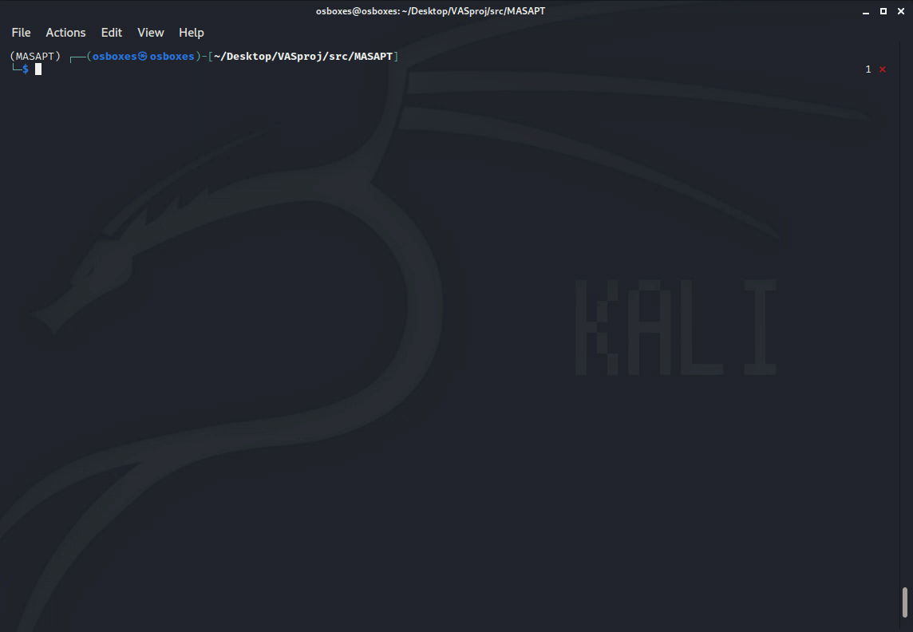
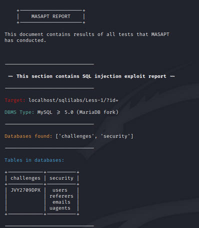
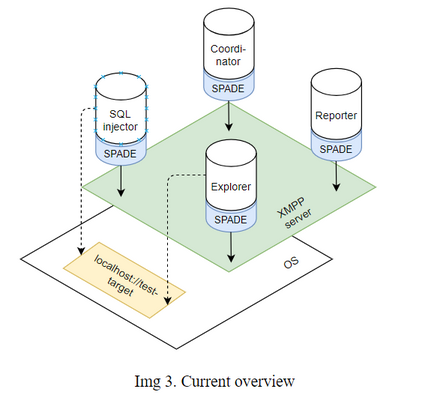
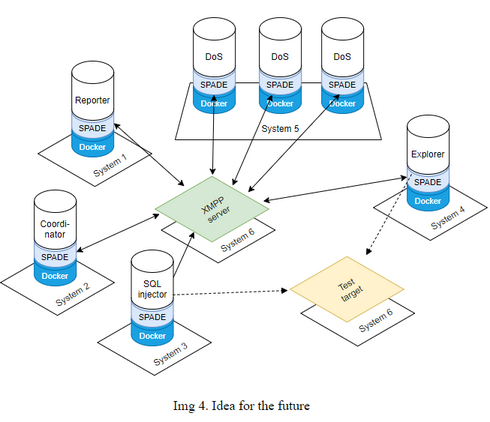

# MASAPT 🤖 ↔ &#129302; ↔ 🤖

___

&nbsp;

_❗_ <span style="color:red">_Disclaimer_</span>


> This tool is developed for academic and research purposes as a part of the university course.
  The use of MASAPT for attacking targets without prior consent is illegal.
>
> Developers hold no responsibility for any damage made with this tool and
  condemn any nefarious usage of MASAPT. This tool is not ment to be used in any professional
  environment at this point, it is just a _proof-of-concept_ for the underlying theoretical
  model.

___

## **Welcome to...**

_Multi-Agent System for Automated Penetration Testing_ 🐱‍💻



&nbsp;

### Explore → Exploit → Report → 📝

An autonomous system of _[SPADE](https://spade-mas.readthedocs.io/en/latest/index.html)_ agents communication over XMPP to coordinate and perform
penetration testing. In a CLI tool!

Pass the URL, wait a bit, read the report!

&nbsp;
&nbsp;

 

___

## What is MASAPT?

It's a _proof-of-concept_, multi-agent system, developed in Python, intented to be used
for automating the process of penetration testing in a structured and inteligent way.

**The ultimate goal** is to make a working, flexible, distributed, CLI based - pentesting
tool that can be used for automating penetration testing tasks.

Current features:

- Performing network scanning with __Nmap__
- Performing basic SQL injection with __SQLMap__
- Generating report with the results of performed exploits and reconnaissance

Future plans and features are listed [here](#Further-work).
___

### How to run?

_Difficult_.

#### **Install requirements:**

There's a fair number of prerequisites and requirements to install:

- Kali Linux 2020.4 (_optional_) - any Debian based OS should work fine.
- Python 3.8
- Pip3
- SPADE
- SQLMap (Already installed on Kali)
- Nmap (Already installed on Kali)

Beside Python and pentesting tools that can be found on Kali, you also need
access to some XMPP service. For testing the system I used [**ejabberd**](https://www.ejabberd.im/)
running locally.

To run the agents on your XMPP server of choice, you will need to create
the following users. You can of course create other users, but then you
will need to pass the new JID and PWD parameters when creating agents in
_masapt_ script.

| JID | PASSWORD |
| :--:| :------: |
| _repoter@domain_ | repoterSecret |
| _explorer@domain_ | explorerSecret |
| _coordinator@domain_ | coordinatorSecret |
| _sqlinjector@domain_ | injectorSecret |

#### **Setup:**

After the prerequisites have been installed and XMPP has been set up:

1. cd into the project folder

    ```bash
        cd ../MASAPT
    ```

2. Add directory to PATH

    ```bash
        export PATH=$PATH:/path/to/MASAPT
        source ~/.bashrc
    ```

3. Install python requirements

    ```bash
        pip install -r requirements.txt
    ```

4. Make _masapt_ script executable

    ```bash
        chmod +x masapt
    ```

#### **Run:**

Start the system with:

```bash
    masapt -t url/to/target
```

&nbsp;

___

### Further work

- [ ] install.sh script
- [ ] Docker agents
- [ ] Connect with exploit database/knowledge base

**More agents:**

- [ ] DoS agent
- [ ] XSS agent
- [ ] Buffer overflow agent

**Expand _Explorer.py_ so it can:**

- [ ] Run Harvester
- [ ] Run more OSINT tools

**Expand _SQLinjector.py_ so it can:**

- [ ] Make better use of SQLMap
- [ ] Be adaptable to more types of databases

**Expand _Coordinator.py_ so it can:**

- [ ] Make better decisions about which agents perform attacks

___

## System overview 🔎

MASAPT system was envisioned to be **_modular_**, **_distributed_** and **_pragmatic_**. Meaning that agents
that make up the system are independent of the main process, upgradeable and use existing, 'battle-tested'
pentesting tools.

To achieve the goals envisioned, agents are developed as part of a **_three-tier model_** which is derived from
standard pentest phases (_planning - execution - post execution_). High overview of said model can be seen on **Img1** below.

All theoretical concepts in this overview have already been implemented in code (apart from the idea for the future - **Img 8.**). These concepts should continue to be implemented in any future upgrades to the system.

### _Three-tier model_

Main idea behind the _three-tier model_ is to provide a framework to be used for organizing and classifying agents in this system.

First tier of the model contains the **Explorer** agent(s) which are tasked with conducting OSINT and gathering any useful intelligence about the target.

Second tier contains the **Coordinator** agent and **_Exploit_** agents. The Coordinator is a single agent
that decides which exploit agents are going to take part in the current testing. Exploit agents, as the name
implies, are the ones running exploits - SQL injection, XSS, DoS, buffer overflow... There can be many of
these exploit agents.

Third tier contains the **Reporter** whose task is to collect all exploit data, results, data dumps from
all exploit agents and summarise it in a final report. The report is then showed to the user and stored
locally.

In the first image, thick arrows represent the flow of data in the model.

&nbsp;

 &ensp; &ensp; 

&nbsp;

**Img2** shows the same model as the first image but in greater detail - agents can be
clearly seen in their respective tiers. The _full_ arrows in this image again represent the flow of data
in the model which consequently shows which agents are communicating with each other. It can be seen that
**Explorer** agent sends data to the **Coordinator** agent, who then in turn sends some data to the
**Exploit** agents (SQLinjector, agent2, agent3). Finally, all the data that exploit agents gather is
passed to the **Reporter** agent who then compiles it, summarises it and presents it to the user.

It can also be seen that only **Explorer** and **Exploit** (SQLinjector) agents interact with the
outside environment (Test target). This is represented with two-way _dotted_ arrows.

___

### Architecture

As mentioned earlier, one of the characteristics of the MASAPT system is for it to be distributed. One aspect of this has already been implemented seeing how all agents are implemented as
independent programs, run by the main ([_masapt_](masapt)) script.

**Img 3.** shows how the current system was setup and tested. It can be seen that agents use the SPADE
environment to communicate over XMPP (ejabberd) server which is setup on the local system. Test target
([SQLi Labs](https://github.com/Audi-1/sqli-labs)) is also setup on the local system. This setup is good
for testing the system but it doesn't show full capability of MASAPT as a distributed system.


&nbsp;

<p align="center">    
    
</p>

&nbsp;

**Img 4.** on the other hand, shows one possible future implementaion of MASAPT. It shows a distributed multi-agent system
that uses XMPP to communicate and Docker to run accross many different systems. _Full_ arrows once again show the
communication and data flow aspect of the system, showing how agents send and receive their data over a central XMPP server.

&nbsp;

<p align="center">    
    
</p>

&nbsp;

#### Reason for XMPP

Main reason for agents to communicate over XMPP is to provide a reliable, language-agnostic way for agents
to communicate. With this approach, not all future agents have to be written in Python or even use the
SPADE environment.

Reasoning behind this is that there may be some use case for a different system to be part of MASAPT
in the future (ex. agents written in other programming languages). So this 'XMPP approach' is the best way to provide that kind of flexibility to the system.

### Agent behaviour

Aside its ability to communicate, behaviour is the second most important aspect of any agent.
MASAPT agents and their behaviour is modelled with a set of states, which makes them finite state machines. SPADE environment has good support for creating finite
state machines.

Diagrams below show all possible states an agent can be in at any moment
in time. Diagrams also show which events cause agent to switch to the next state.
All future agents should be implemented in the same manner.

All future exploit agents (ex. DoS, XSS...) should be implemented using the **Img 8.** diagram as template.

&nbsp;

 

&nbsp;

 &ensp; 

&nbsp;


## References 🔗

[1] Big thanks to **_Audi-1_** and his excellent [SQLI labs](https://github.com/Audi-1/sqli-labs)
for testing error based, blind boolean and time based SQL injection!

[2] [Chu, Ge, and Alexei Lisitsa. "Agent-based (BDI) modeling for automation of penetration testing." arXiv preprint arXiv:1908.06970 (2019).](https://arxiv.org/abs/1908.06970)

[3] [Qiu, X., Wang, S., Jia, Q., Xia, C., & Xia, Q. (2014, October). An automated method of penetration testing. In 2014 IEEE Computers, Communications and IT Applications Conference (pp. 211-216). IEEE.](https://ieeexplore.ieee.org/abstract/document/7017198)
