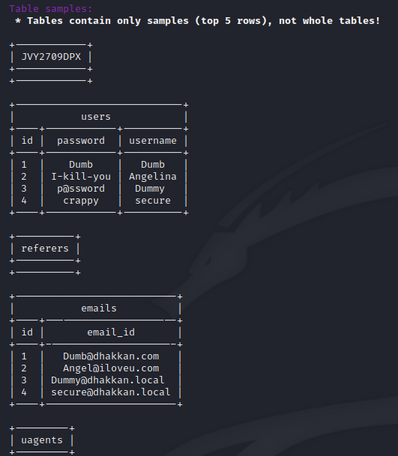

# MASAPT 🤖 ↔ &#129302; ↔ 🤖
___

&nbsp;

_❗_ <span style="color:red">_Warning_</span>


> This tool is developed for academic and research purposes as a part of the
  _Multiagent systems_ course at _Faculty of organization and informatics_.
  This tool is not to be used without consent of a second party whose security
  is being tested.
>
> Author holds no responsibility for any damage made with this tool and
  condemns any nefarious usage of the same.

___

## Welcome to...

_Multi-Agent System for Automated Penetration Testing_ 🐱‍💻


&nbsp;

### Explore → Exploit → Report → 📝

A autonomous system of agents communication over XMPP to coordinate and perform
penetration testing. In a CLI tool!

Pass the URL, wait a bit, read the report!

&nbsp;
&nbsp;

 

___

## What is MASAPT?

It's a _proof-of-conept_, multi-agent system for automating the process of penetration testing.

**The ultimate goal** is to make a working, flexible, distributed, CLI based - pentesting tool
that can be used for automating penetration testing tasks.

Currently implemented features:

- Performing network scanning with __Nmap__
- Performing basic SQL injection with __SQLMap__
- Generating report with the results of performed exploits and reconnaissance

Future plans and features are listed [here](#Further-work).
___

### How to run?

_Difficult_.

#### Install requirements

There's a fair number of prerequisites and requirements to install:

- Kali Linux 2020.4 (_optional_) - any debian based OS should work fine.
- Python 3.8
- Pip3
- SQLMap (Already installed on Kali)
- Nmap (Already installed on Kali)

Beside Python and pentesting tools that can be found on Kali, you also need
access to some XMPP service. For testing the system I used **ejabberd**
running locally.

To run the agents on your XMPP server of choice, you will need to create
the following users. You can of course create other users, but then you
will need to pass the new JID and PWD parameters when creating agents in
_masapt_ script.

| JID | PASSWORD |
| :--:| :------: |
| _repoter@domain_ | repoterSecret |
| _explorer@domain_ | explorerSecret |
| _coordinator@domain_ | coordinatorSecret |
| _sqlinjector@domain_ | injectorSecret |

#### **Setup:**

After the prerequisites have been installed and XMPP has been set up:

1. cd into the project folder

    ```bash
        cd ../MASAPT
    ```

2. Add directory to PATH

    ```bash
        export PATH=$PATH:/path/to/MASAPT
        source ~/.bashrc
    ```

3. Install python requirements

    ```bash
        pip install -r requirements.txt
    ```

4. Make _masapt_ script executable

    ```bash
        chmod +x masapt
    ```

#### **Run:**

Start the system with:

```bash
    masapt -t url/to/target
```

&nbsp;

___

### Further work

- [ ] install.sh script
- [ ] Docker agents
- [ ] Connect with exploit database/knowledge base

**More agents:**

- [ ] DoS agent
- [ ] XSS agent
- [ ] Buffer overflow agent

**Expand _Explorer.py_ so it can:**

- [ ] Run Harvester
- [ ] Run more OSINT tools

**Expand _SQLinjector.py_ so it can:**

- [ ] Make better use of SQLMap
- [ ] Be adaptable to more types of databases

**Expand _Coordinator.py_ so it can:**

- [ ] Make better decisions about which agents perform attacks

___

## System overview 🔎

## Theory dive 📜

## References 🔗

[1] Big thanks to **_Audi-1_** and his excellent [SQLI labs](https://github.com/Audi-1/sqli-labs)
for testing error based, blind boolean and time based SQL injection!

[2] [Chu, Ge, and Alexei Lisitsa. "Agent-based (BDI) modeling for automation of penetration testing." arXiv preprint arXiv:1908.06970 (2019).](https://arxiv.org/abs/1908.06970)

[3] [Qiu, X., Wang, S., Jia, Q., Xia, C., & Xia, Q. (2014, October). An automated method of penetration testing. In 2014 IEEE Computers, Communications and IT Applications Conference (pp. 211-216). IEEE.](https://ieeexplore.ieee.org/abstract/document/7017198)
